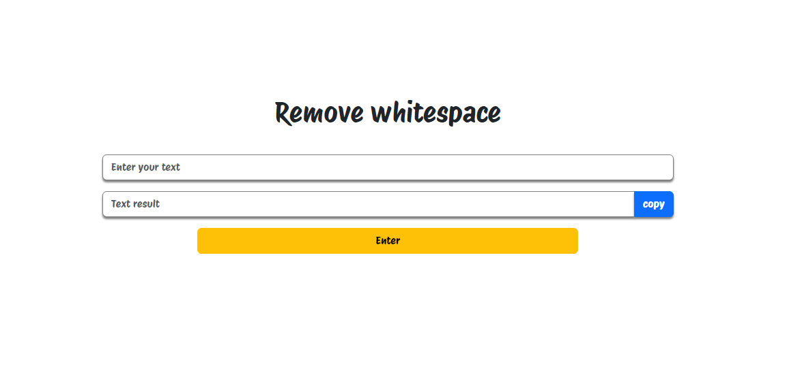

# remove-whitespace-js
This repository contains a script to remove whitespace from text.

## Idea

Time is a crucial thing in my work environment and I often need to reduce many things to be able to consume less time. One of these things is **INVOICE NUMBER**.

The big problem is the time it takes to remove white spaces between them before being able to proceed with the next step.

So, I thought: *"Why not create a website that does this for me?"*.

And from that, this simple but **GREATLY USEFUL** project emerged.

## How to access?

**Access Link**: [removeWhiteSpace](https://luccxx.github.io/remove-whitespace-js/)

## Contributions

Contributions are welcome! Feel free to open issues or send pull requests for improvements.

## License

This project is licensed under the MIT License.

